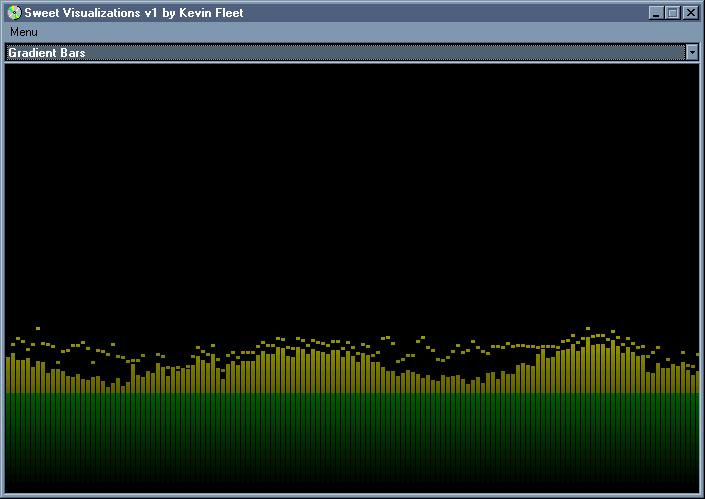



## Sweet Music Visualizations v1 \[resubmitted for may\]

### Description

this is my first try at a music visualization program. so dont expect the best. i could never find code that would run a visualization on my machine so when i did, well... it sucked. it only had one visualization and a simple one... so i added some visualizations and i want to share it with u! please VOTE and leave SUGGESTIONS!

i know i have already submitted this... but i missed the 12:00 am deadline by like and hour or 2 so it wasnt entered in may's contest.... it may be a hassle but please re-vote!
 
### More Info
 

             |
---                |---
**Submitted On**   |2002-04-30 17:21:32
**By**             |[poop\_4\_brains](https://github.com/Planet-Source-Code/PSCIndex/blob/master/ByAuthor/poop-4-brains.md)
**Level**          |Intermediate
**User Rating**    |4.8 (43 globes from 9 users)
**Compatibility**  |VB 5\.0, VB 6\.0
**Category**       |[Graphics](https://github.com/Planet-Source-Code/PSCIndex/blob/master/ByCategory/graphics__1-46.md)
**World**          |[Visual Basic](https://github.com/Planet-Source-Code/PSCIndex/blob/master/ByWorld/visual-basic.md)
**Archive File**   |[Sweet\_Musi78216512002\.zip](https://github.com/Planet-Source-Code/poop-4-brains-sweet-music-visualizations-v1-resubmitted-for-may__1-34301/archive/master.zip)

